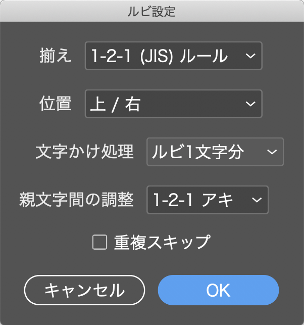

# InDesign Ruby Processor

The ExtendScript for InDesign that set ruby in batches by CSV.  
The 'ruby' does not mean 'Programming language' in this sentence.

CSVでルビを一括で指定するInDesign用スクリプトです。
おまけでpixivのルビ書式を変換するスクリプトもあります。

## Installation

Copy the files under 'dist' into the InDesign Scripts Panel folder.

dist以下のファイルをScripts Panelフォルダにコピーしてください。  
スクリプトパネルでcontrol+クリックまたは右クリックして「Finderで表示」または「エクスプローラーで表示」を選択するとフォルダを開くことができます。

- macOS : ~/Library/Preferences/Adobe InDesign/Version xxxx/LANG/Scripts/Scripts Panel
- Windows : %HOMEPATH%\Application Data\Adobe\InDesign\Version xxxx\LANG\Scripts\Scripts Panel

スクリプトパネルでの表示名を変えたい場合はファイル名を変更してください。ただし後述の RUBY_PROCESSOR.conf 内の名前は変えないでください（値を読み込めなくなります）。

## Usage

### CSV Ruby Processor

ルビ情報を書いたCSVファイルを読み込んで、一括でルビを設定します。ロックされたレイヤー、非表示のレイヤーは対象としません。

起動すると、まずルビの書式設定が開きます。「OK」を押すと、次にCSVファイルの選択画面が出るので、ルビ情報のCSVを選択してください。

CSVのデータは以下の構造になっています。

*ルビを振る文字,ルビ,文脈,フラグ*

<dl>
	<dt>ルビを振る文字</dt>
	<dd>ルビを振る対象となる文字です。</dd>
	<dt>ルビ</dt>
	<dd>ルビのテキストです。捨て仮名（ゃゅょなど）は普通の仮名に変換されます。複数文字の対象に1文字ずつルビを振りたい（モノルビにしたい）場合は、全角スペースで区切ってください。詳細は後述。</dd>
	<dt>文脈</dt>
	<dd>省略可。同じ漢字でも送り仮名によって読みが変わるなど、特定の文脈を正規表現で指定できます。詳細は後述。</dd>
	<dt>フラグ</dt>
	<dd>省略可。0〜2の値を設定します。0 : すべての対象にルビを振る, 1 : ドキュメント内で最初の対象のみにルビを振る, 2 : ページ内で最初の対象のみにルビを振る</dd>
</dl>

#### グループルビとモノルビ

「花屋」に「はなや」とまとめてルビを振るのがグループルビ、「花」に「はな」「屋」に「や」と一文字ずつ振るのがモノルビです。

*花屋,はなや*

とするとグループルビとなります。これをモノルビにする場合は以下のようにルビを全角スペースで区切ります。

*花屋,はな　や*

区切ったルビの数が対象の文字数より多い場合、超過分は無視されます。

#### 文脈

例えば「気圧」に「けお」とルビを振りたい場合、そのままだと「気圧が高い」という文章にもルビが振られてしまいます。文脈に「気圧され」と入れると、これを防ぐことができます。

*気圧,けお,気圧され*

また、正規表現を用いて、以下のように送り仮名によってルビを分けるといったこともできます。

*歩,ある,歩[かきくけこ]*  
*歩,あゆ,歩[まみむめも]*  
*愛,あい,愛(して|する)*  
*愛,いと,愛し[いく]*

## pixiv Ruby Converter

pixivの小説投稿で使われているルビ書式 [[rb: xxxx > yyyy]] をInDesignのルビに変換します。pixivの編集画面からコピペしたときに使ってください。

設定項目は「CSVルビ一括設定」と同じです。ロックされたレイヤー、非表示のレイヤーは対象としません。また、すべてグループルビになります。

## Default Settings

See 'RUBY_PROCESSOR.conf'. It is vanilla JavaScript file.

各スクリプトの初期値は RUBY_PROCESSOR.conf で設定できます。中身はJavaScriptの文法に従います。  
このファイル自体は無くても動きます。

各パラメータは数値で指定します。数値と設定値の対応はファイルの上部に書かれているので参考にしてください。

スクリプトパネルに表示されるのが邪魔なときは、スクリプトパネル右上のメニューから「サポートされていないファイルを表示」のチェックを外してください。

## Requirements

I have checked on environment below.

以下の環境で動作確認済みです。

- InDesign 2022 / macOS Big Sur
- InDesign 2022 / Windows 10

## License

[MIT](https://github.com/escapism/InDesignRubyProcessor/blob/master/LICENSE)